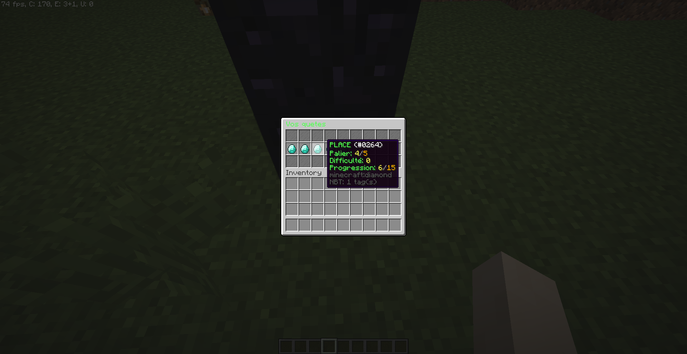

# Player-Level

Player Level is a plugin of quests for players. When a player complete a quest, he win xp to level up his global level. You can choose the reward for each level (MONEY or POINTS). With the points (or money) player can bought upgrade for certain abilities.
You can create your customs quests and abilities.

I take all suggestions for adding quest and abilities types (you can suggest quest type which need other plugins)

Need Vault to work correctly.

Commands:
/level open the level inventory
/quest open the quest inventory
/quest progress add <player> <questId> <progress> Add progress in a quest for a player, need playerlevel.admin permission

You can reload config and lang files with: /level reload
Need the permission: playerlevel.reload

Some screenshots:

For more informations of how to create custom quest and custom abilities, go here: https://terrasia.gitbook.io/numbtus-plugins/v/playerlevel